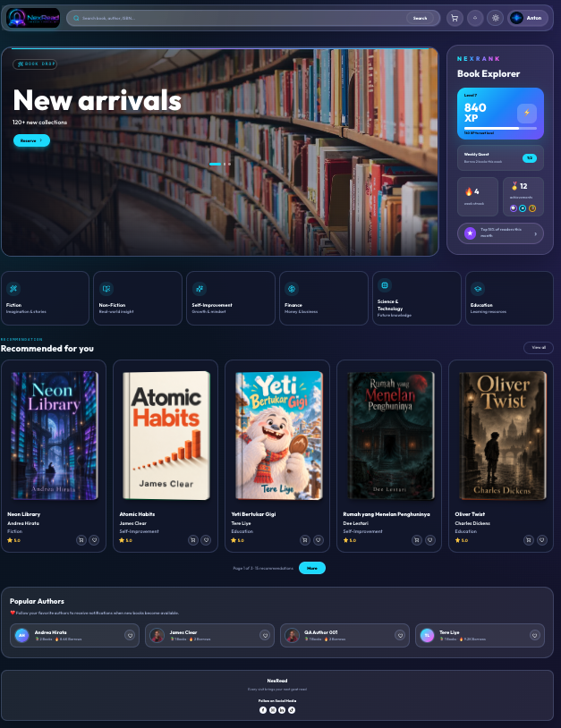
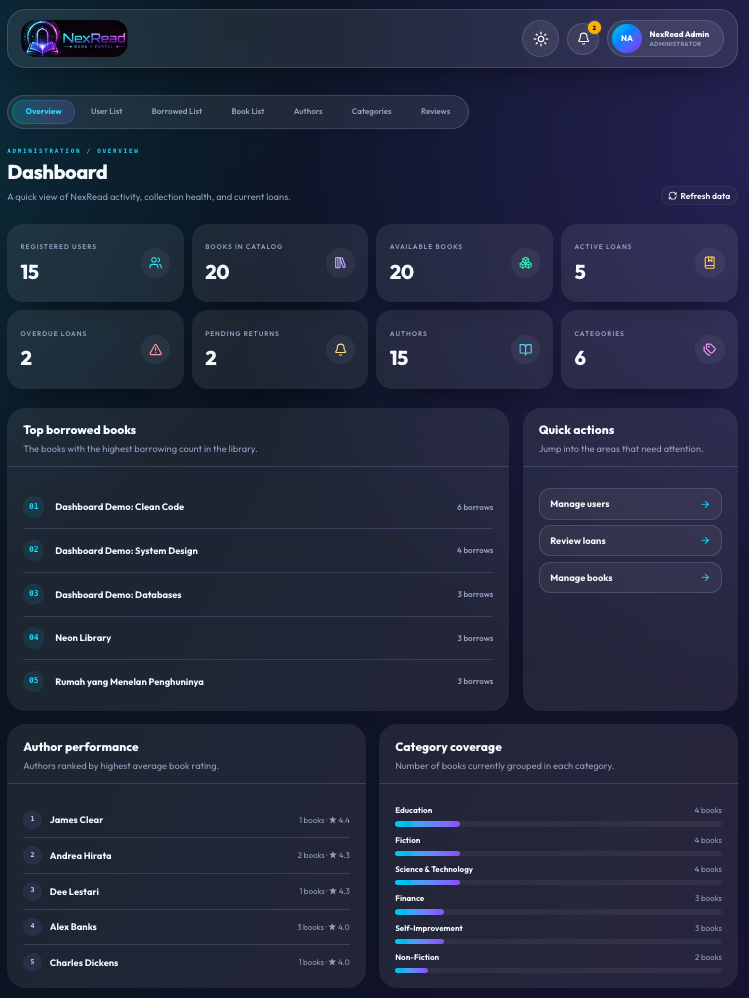
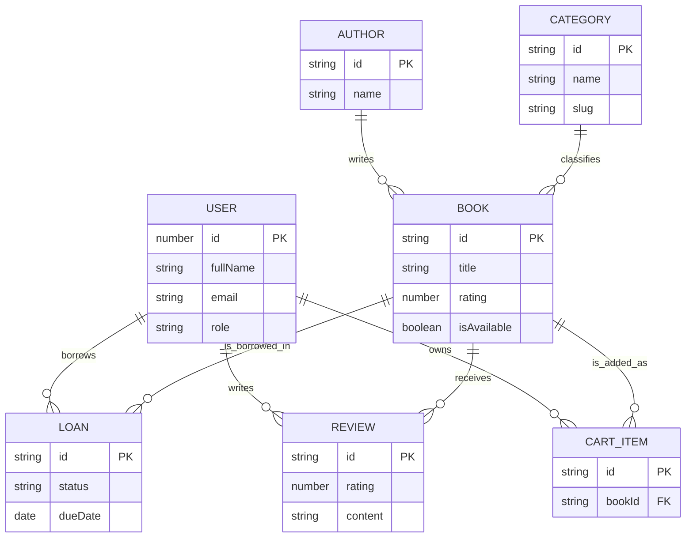

# NexRead

NexRead is a library web application built with Next.js, React, TypeScript,
Tailwind CSS, and shadcn/ui. It supports book discovery and borrowing flows
for readers, plus protected catalog, loan, user, author, category, and review
management for administrators.

## Live Demo

[Open NexRead](https://nexread.ai-novanx.online/)

Backend API: [Railway staging deployment](https://crack-be-ai-novanx-staging.up.railway.app/)

## Application Preview



<figure>
  
  <figcaption>Aplikasi Admin Nexread.</figcaption>
</figure>

## Data Model

The backend manages the persisted catalog and borrowing data used by the
frontend. Favorites are currently browser-local, keyed by the signed-in user;
see [docs/favorites.md](docs/favorites.md) for the planned API contract.



## Tech Stack

- Next.js 16 with App Router
- React 19
- TypeScript
- Tailwind CSS 4
- shadcn/ui components
- lucide-react icons
- React Hook Form for auth form handling
- Railway staging API for catalog, authentication, user, loan, cart, and
  review data

## Current Features

- Authentication pages for login and registration, backed by HttpOnly session
  cookies.
- Shared user header with NexRead logo, search form, cart action,
  notification action, profile action, and dark/light theme toggle.
- Header search waits 400 ms after typing, then updates `/book-list?search=...`; Enter or Search submits immediately. Existing category/rating filters are preserved. It filters books by
  title, author, or category.
- Home page sections:
  - Hero section
  - Book categories
  - Recommended for you
  - Popular authors
  - Shared footer
- Book category cards link to filtered Book List views using search params.
- Book List page with:
  - Category filtering
  - Rating filtering
  - Search query filtering
  - Shared book card styling
- Popular Authors cards link to author detail pages.
- Author detail page shows author summary and books by selected author.
- Reader flows for cart, checkout, loan history, profile, and personal reviews.
- Protected admin dashboard with catalog and borrowing analytics.
- Admin book management with listing, search, availability filtering, create,
  edit, detail, and delete actions.
- Admin loan list with status filtering, search, pagination, and return
  approval.
- Admin user list with pagination and backend search.
- Admin author and category management with search, pagination, create, edit,
  delete confirmation, toast feedback, and error dialogs.
- Admin review management with search, pagination, review deletion controls,
  confirmation dialogs, and error dialogs.
- Author API data includes author id, name, book count, borrow count, rating,
  and avatar asset.
- Book API data includes title, author, category, rating, and cover gradient.
- Category API data includes category id, name, slug, subtitle, and icon path.

## Getting Started

Install dependencies:

```bash
npm install
```

Start the development server:

```bash
npm run dev
```

Open [http://localhost:3000](http://localhost:3000).

## Scripts

```bash
npm run dev
npm run lint
npm run build
npm run start
npm test
npm run test:coverage
npm run test:e2e
```

## Testing

Vitest and React Testing Library cover deterministic unit and component
behavior. Playwright verifies browser-level user journeys in Chromium. Run
`npx playwright install chromium` once before the first local E2E run.

Coverage and browser reports are generated locally but ignored by Git; CI
uploads them when a test job fails. See [docs/testing.md](docs/testing.md) for
commands, report locations, and test-writing conventions.

## Main Routes

- `/` - user home page
- `/login` - login page
- `/register` - registration page
- `/book-list` - book list page
- `/book-list?category=Fiction` - book list filtered by category
- `/book-list?rating=4` - book list filtered by rating group
- `/book-list?search=white%20fang` - book list filtered by search query
- `/authors/[id]` - books by selected author
- `/admin/dashboard` - admin analytics dashboard
- `/admin/books` - book management
- `/admin/authors` - author management
- `/admin/categories` - category management
- `/admin/loans` - loan management and return approval
- `/admin/reports` - admin reports placeholder
- `/admin/reviews` - review management
- `/admin/settings` - admin settings placeholder
- `/admin/users` - user list and search

## Project Structure

```text
src/
├── app/
│   ├── (auth)/
│   ├── (user)/
│   ├── admin/
│   └── globals.css
├── assets/
│   ├── icons/
│   ├── images/
│   └── logos/
├── components/
│   ├── home/
│   ├── layout/
│   ├── shared/
│   └── ui/
├── lib/
├── services/
│   ├── authors.ts
│   ├── books.ts
│   └── categories.ts
├── types/
└── utils/
```

## Backend integration

Copy `.env.example` to `.env.local` before starting the app:

```bash
cp .env.example .env.local
npm run dev
```

The default targets the staging backend:

```env
NEXT_PUBLIC_API_BASE_URL=https://crack-be-ai-novanx-staging.up.railway.app
```

Restart the dev server after changing the URL. For deployment, set this variable
on the hosting platform before building. The base URL has no `/api` suffix:
`/api` on the backend hosts Swagger; catalog endpoints use `/books`, `/authors`,
and `/categories`. Cart endpoints, when integrated, use `/api/cart`.

Catalog services use the Next.js Data Cache with a 60-second revalidation window
and map nested backend author/category objects into the UI types. Read requests
retry transient network failures twice. Home sections and the Book List show an
inline retry state when neither live nor cached data is available, so navigation
and the rest of the page remain usable. Known avatar/icon paths map
to bundled assets; unknown paths use a generic local fallback. No mock records
are used as a fallback for API failures. User routes have loading/error states.

Category names in existing links resolve to backend category IDs. Search still
matches title, author and category, and rating filters still match integer rating
groups. Those filters read all matching backend pages before filtering because
the backend currently provides only title search and minimum rating. For larger
catalogs, extend the backend search/rating contract to avoid this extra work.

Authentication uses same-origin Next.js routes at `/api/auth/login`, `register`,
`session`, and `logout`. Access/refresh tokens stay in HttpOnly, SameSite=Lax
session cookies (Secure in production), never in localStorage or JSON responses
to the browser. Session lookup checks `/me` and refreshes expired access tokens;
logout revokes the backend refresh token. Mutation routes validate Origin.
Registration sends `fullName`, `email`, and `password` and signs the user in.
The phone field was removed because the backend registration contract has no
phone property. Old mock account storage is cleared.

Global UX feedback includes an offline banner, accessible inline form errors,
loading skeletons, status-aware API messages, success/error toasts, route error
boundaries, and a confirmation modal before logout. Ordinary network failures
remain inline so they do not interrupt the user's work.

Admin routes and `/api/admin/*` are protected by the same middleware. The
middleware verifies the session through `/me`, allows only the `admin` role,
and forwards the short-lived access token to same-origin Next.js API proxies.
Those proxies keep the token out of browser JavaScript and validate `Origin`
for mutation requests.

The backend currently does not expose a global `GET /reviews` endpoint. The
admin review proxy tries that endpoint first, then falls back to collecting
reviews from each book detail response. This keeps the review list available,
but it is less efficient for a large catalog. Review deletion still requires a
backend `DELETE /reviews/:id` endpoint; if the backend uses another path, adapt
`src/app/api/admin/reviews/route.ts` to that contract.

Reports and Settings remain placeholders. Any unimplemented backend capability
is surfaced with inline feedback or an accessible error dialog rather than
mocked data.

## Styling Notes

- Tailwind CSS 4 is configured through `globals.css`.
- The color palette is exposed through CSS variables and Tailwind theme tokens.
- Reusable UI primitives live in `src/components/ui`.
- Book cards across Recommended for You, Book List, and Author detail pages use
  the same visual properties for consistency.

## Conventions

- Use TypeScript for application code.
- Keep reusable layout components in `components/layout`.
- Keep home-specific sections in `components/home`.
- Keep shared shadcn-style primitives in `components/ui`.
- Put route-specific filtering state in search params when the result should be
  shareable or reload-safe.
- Keep API calls and response mapping in `src/services`.
- Keep admin-only browser requests behind `src/app/api/admin` route handlers.
- Keep supported book cover styles in `src/lib/book-covers.ts` so Tailwind includes API-provided styles in the build.
